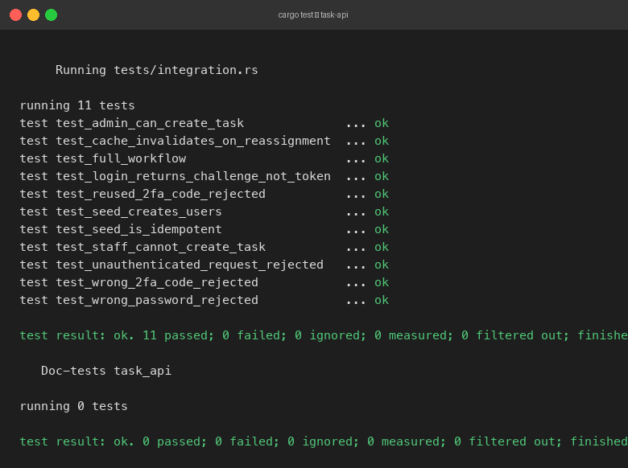

# Task Management API

A Rust backend API with authentication, two-factor login, role-based access control, and Redis caching.

## Tool Versions

| Tool | Version |
|------|---------|
| Rust (rustc) | 1.95.0 (stable, 2026-04-14) |
| Cargo | 1.95.0 (2026-03-21) |
| Edition | 2021 |
| PostgreSQL | 15.17 (Homebrew) |
| Redis | 8.8.0 (via Docker `redis:7-alpine`) |
| Docker | 29.2.1 |

### Key crate versions (from `Cargo.toml`)

| Crate | Version |
|-------|---------|
| axum | 0.7 |
| sqlx | 0.7 |
| tokio | 1 |
| redis | 0.25 |
| argon2 | 0.5 |
| jsonwebtoken | 9 |
| serde | 1 |
| sha2 | 0.10 |
| tower-http | 0.5 |
| uuid | 1 |
| chrono | 0.4 |

## Stack

- **Axum 0.7** — HTTP framework
- **SQLx 0.7** — async PostgreSQL driver with compile-time query checking
- **PostgreSQL 15** — primary database
- **Redis** — per-user task caching
- **Argon2** — password hashing
- **JWT (HS256)** — access tokens after 2FA verification
- **SHA-256** — one-way OTP hashing (codes never stored in plain text)
- **Tokio** — async runtime

## Prerequisites

- Rust 1.95.0+ stable (edition 2021) — install via [rustup](https://rustup.rs)
- PostgreSQL 15 running locally
- Redis — run via Docker: `docker run -d -p 6379:6379 redis:7-alpine`
- Docker 29+ (for Redis)

## Setup

### 1. Clone and configure

```bash
cp .env.example .env
# Edit .env if your PostgreSQL user or credentials differ
```

### 2. Create databases

```bash
# Adjust the binary path to match your PostgreSQL installation
/opt/homebrew/Cellar/postgresql@15/15.17/bin/psql -U $(whoami) -d postgres -c "CREATE DATABASE task_api;"
/opt/homebrew/Cellar/postgresql@15/15.17/bin/psql -U $(whoami) -d postgres -c "CREATE DATABASE task_api_test;"
```

### 3. Build

SQLx checks queries at compile time against a live database. Export `DATABASE_URL` before building:

```bash
export DATABASE_URL="postgresql://$(whoami)@localhost:5432/task_api"
cargo build
```

On the first `cargo run` / `cargo test`, SQLx will automatically apply the migration in `migrations/` and create all tables.

### 4. Run

```bash
cargo run
# Server listens on http://127.0.0.1:3000
```

## Running Tests

Tests use a separate `task_api_test` database. Run them serially (the test helper truncates between runs):

```bash
DATABASE_URL="postgresql://$(whoami)@localhost:5432/task_api" \
cargo test -- --test-threads=1
```

All 11 tests pass:



```
running 11 tests
test test_admin_can_create_task              ... ok
test test_cache_invalidates_on_reassignment  ... ok
test test_full_workflow                      ... ok
test test_login_returns_challenge_not_token  ... ok
test test_reused_2fa_code_rejected           ... ok
test test_seed_creates_users                 ... ok
test test_seed_is_idempotent                 ... ok
test test_staff_cannot_create_task           ... ok
test test_unauthenticated_request_rejected   ... ok
test test_wrong_2fa_code_rejected            ... ok
test test_wrong_password_rejected            ... ok

test result: ok. 11 passed; 0 failed; 0 ignored; 0 measured; 0 filtered out; finished in 7.40s
```

## Validation Flow (curl)

### Step 1 — Seed users

```bash
curl -s -X POST http://localhost:3000/seed/users | jq
```

```json
{
  "admin": { "id": "...", "email": "admin@example.com", "role": "admin" },
  "james_bond": { "id": "77737d92-...", "email": "jamesbond@example.com", "role": "staff" }
}
```

Note the `james_bond.id` — you'll need it for the assign step.

### Step 2 — Admin login (returns challenge, not token)

```bash
curl -s -X POST http://localhost:3000/auth/login \
  -H "Content-Type: application/json" \
  -d '{"email":"admin@example.com","password":"AdminPass123!"}' | jq
```

```json
{ "login_challenge_id": "4868c25b-..." }
```

### Step 3 — Get the 2FA code

```bash
curl -s http://localhost:3000/dev/email-logs/latest | jq .body
# "Your 2FA code is: 894583"
```

### Step 4 — Verify 2FA and get Admin JWT

```bash
curl -s -X POST http://localhost:3000/auth/verify-2fa \
  -H "Content-Type: application/json" \
  -d '{"login_challenge_id":"<CHALLENGE_ID>","code":"<CODE>"}' | jq
```

```json
{ "access_token": "eyJ0eXAiOiJKV1Qi...", "token_type": "Bearer" }
```

### Step 5 — Create 5 tasks as Admin

```bash
for title in "Mission Briefing" "Gadget Procurement" "Field Report" "Background Check" "Debrief Session"; do
  curl -s -X POST http://localhost:3000/tasks \
    -H "Authorization: Bearer $ADMIN_TOKEN" \
    -H "Content-Type: application/json" \
    -d "{\"title\":\"$title\",\"priority\":\"high\"}" | jq .id
done
```

### Step 6 — Assign 3 tasks to James Bond

```bash
curl -s -X POST http://localhost:3000/tasks/assign \
  -H "Authorization: Bearer $ADMIN_TOKEN" \
  -H "Content-Type: application/json" \
  -d '{"task_ids":["<T1>","<T2>","<T3>"],"user_id":"<JAMES_ID>"}' | jq
```

```json
{ "assigned": 3 }
```

### Step 7 — James Bond login and 2FA (same as steps 2–4 with Bond credentials)

Password: `Bond007!`

### Step 8 — James Bond tries to create a task (403)

```bash
curl -s -X POST http://localhost:3000/tasks \
  -H "Authorization: Bearer $JB_TOKEN" \
  -H "Content-Type: application/json" \
  -d '{"title":"Sneaky task","priority":"low"}' | jq
```

```json
{ "error": "only admins can create tasks" }
```

HTTP status: **403 Forbidden**

### Step 9 — GET /tasks/view-my-tasks (first call)

```bash
curl -s http://localhost:3000/tasks/view-my-tasks \
  -H "Authorization: Bearer $JB_TOKEN" | jq
```

### Step 10 — GET /tasks/view-my-tasks (second call — cache hit)

Same command again — `cache.hit` flips to `true`.

---

## Final Validation Response

### First call (`cache.hit = false`)

```json
{
  "user": {
    "email": "jamesbond@example.com",
    "role": "staff"
  },
  "tasks": [
    {
      "id": "aa5b7429-10a5-4d57-a999-14ab244bf72c",
      "title": "Mission Briefing",
      "status": "todo",
      "priority": "high",
      "assigned_to": "jamesbond@example.com"
    },
    {
      "id": "d8669fb9-8518-459b-82e8-2040554417e1",
      "title": "Gadget Procurement",
      "status": "todo",
      "priority": "medium",
      "assigned_to": "jamesbond@example.com"
    },
    {
      "id": "856bacfb-e64d-4219-bd46-b80b6e342277",
      "title": "Field Report",
      "status": "todo",
      "priority": "low",
      "assigned_to": "jamesbond@example.com"
    }
  ],
  "summary": {
    "total_assigned_tasks": 3
  },
  "cache": {
    "hit": false
  }
}
```

### Second call (`cache.hit = true`)

Identical response body, except:

```json
"cache": { "hit": true }
```

---

## API Reference

| Method | Endpoint | Auth | Description |
|--------|----------|------|-------------|
| POST | `/seed/users` | None | Create Admin and James Bond (idempotent) |
| POST | `/auth/login` | None | Start login — returns `login_challenge_id`, never a JWT |
| POST | `/auth/verify-2fa` | None | Submit OTP — returns JWT on success |
| GET | `/dev/email-logs/latest` | None | Dev endpoint: view the last generated OTP |
| POST | `/tasks` | Admin JWT | Create a task |
| POST | `/tasks/assign` | Admin JWT | Assign tasks to a user, invalidates their cache |
| GET | `/tasks/view-my-tasks` | Any JWT | Return assigned tasks with cache metadata |

## Project Structure

```
src/
├── main.rs           — entry point
├── lib.rs            — app builder (build_app), exported for tests
├── config.rs         — env-based Config struct
├── error.rs          — AppError with IntoResponse
├── state.rs          — AppState (db pool, redis, config)
├── auth.rs           — JWT creation/verification, Argon2, OTP generation/hashing
├── cache.rs          — Redis get/set/del wrappers
├── middleware.rs     — AuthUser extractor (reads Bearer token)
├── models/
│   ├── user.rs       — User, Role enum
│   ├── task.rs       — Task, TaskStatus, TaskPriority enums
│   ├── challenge.rs  — LoginChallenge
│   └── email_log.rs  — EmailLog
└── handlers/
    ├── seed.rs       — POST /seed/users
    ├── auth.rs       — POST /auth/login, POST /auth/verify-2fa
    ├── tasks.rs      — POST /tasks, POST /tasks/assign, GET /tasks/view-my-tasks
    └── dev.rs        — GET /dev/email-logs/latest
migrations/
└── 20240101000001_init.sql   — all schema in one file
tests/
└── integration.rs    — 11 integration tests covering the full workflow
```

## Caching Design

The `GET /tasks/view-my-tasks` endpoint uses a per-user Redis key: `tasks:user:{user_id}`.

- **First request**: queries PostgreSQL, stores the result in Redis with a 300-second TTL, returns `cache.hit: false`.
- **Subsequent requests within TTL**: returns the cached value and sets `cache.hit: true`.
- **Cache invalidation**: `POST /tasks/assign` deletes the key for the assigned user immediately after updating the database.

The `cache.hit` field is determined at the handler level — it is not stored in Redis and is never guessed.

## Security Notes

- Passwords are hashed with Argon2id (not reversible).
- OTPs are hashed with SHA-256 before storage — the plain-text code only appears in the `email_logs.body` column (a dev-only table).
- OTPs expire after 5 minutes and are single-use (marked `used = true` after verification).
- JWTs are signed with HS256. The `JWT_SECRET` must be long and random in production.
- Role enforcement is checked in every handler that requires it — there is no trust in client-supplied role claims beyond what the JWT contains.
